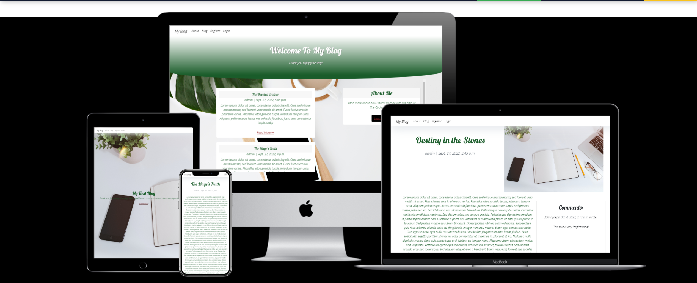
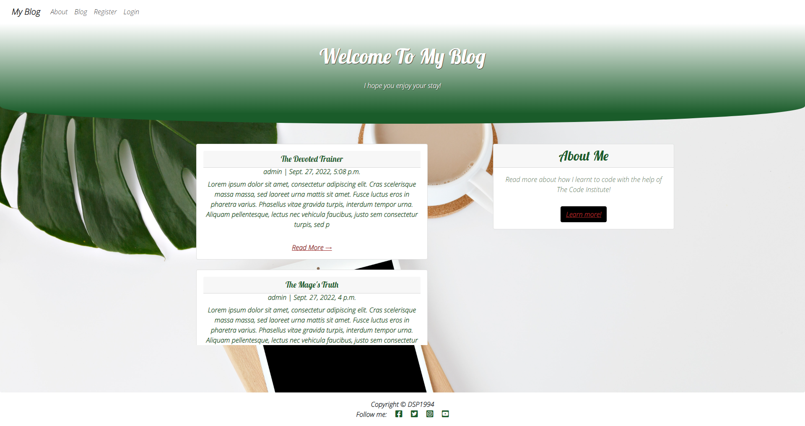
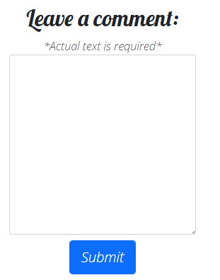
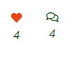
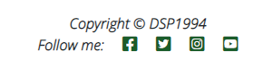
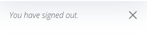

# **My Blog App**

## **Code Institute Project 4**
***
---- Blog Project Description ----


***
## **[Live Site](https://blogapp2022.herokuapp.com/)**
***
## **Table of Contents**

- [Personal Thoughts](#personal-thoughts)
- [UX Design](#ux-design)
    - [Strategy](#strategy)
    - [Scope](#scope)
    - [Structure](#structure)
        - [User Stories](#user-stories)
    - [Skeleton](#skeleton)
        - [Site Flow](#site-flow)
        - [Database Schema](#database-schema)
        - [Wireframes](#wireframes)
    - [Surface](#surface)
        - [Colour Scheme](#colour-scheme)
        - [Typography](#typography)
- [Agile Development Process](#agile-development-process)
- [Current Features](#current-features)
    - [Navbar](#navbar)
        - [Log In](#log-in)
        - [Log Out](#log-out)
        - [Register](#register)
    - [Front Page](#front-page)
    - [About Page](#about-page)
    - [Blog](#blog)
    - [Blog Details](#blog-details)
    - [Footer](#footer)
- [Future Implements](#future-implements)
- [Testing](#testing)
- [Deployment](#deployment)
- [Tech Used](#tech-used)
- [Credits](#credits)
***

## **Personal Thoughts**
Before getting into this README.md file, I would like to make a note of how much I struggled for this Project. It was such a jump in skill and ability levels from the previous three projects. After spending almost 3 and a half weeks on my original project, I was then told I would probably be best scrapping it entirely and starting from scratch due to the number of errors that were found in the code. This was extremely disheartening to hear after spending over 60-70 hours painstakingly doing my best. I then ended up restarting four times, as nothing seemed to meet the standards I was setting myself. However with just over 10 days left, I decided to just do my absolute best. I do not feel that this website represents my best work, as I have cramed 6 weeks worth of time into 10 days. There are so many ideas I have for this website, and designs I'd like to try, but with work, and life getting in the way, I simply do not have the time to do so.

I have to say, this is one of the hardest things I've had to do in a long time. I do feel like I have learned a lot on this project, good and bad. I am disappointed that I will not be able to showcase my best ability, but with the time I had left to complete this project, I feel like it is the best it can be. I hope that for Project 5 I won't make so many base starting errors which lead me to having restart 3/4's of the way through the project. 

Thank you for taking the time to read this, and please, enjoy the README.md file. I hope it is up to standard.
***
## **UX Design**
***
***
### **Strategy**

* Project Goal
    * To create a website that allows a user to view, comment, like and remove likes on various blogs.  
* Target Audience
    * Simply, anyone who enjoys reading! 
* User Needs
    * The User needs to feel welcomed to the blog, with a easy to use homepage and interface.
    * They should be able to leave their opinions and express whether or not they have enjoyed a blog via liking or not liking it.

### **Scope**
For me, the best way to manage my ideas, and help my organise what I wanted to implement, I have set up a three tier plan, of what must, should and could be added to the site.
* Must Have 
    * Front Page
    * Blog Page
    * Blog Details Page
    * Comment Section
    * Like/Unlike
    * User Log In/Out
* Should Have
    * Contact Page
    * Alert Boxes
    * About Section
* Could Have
    * Adverts On Front Page
    * Local News/Weather Updates

### **Structure**
* A clear and straight forward layout which ensures that new and old site users can navigate using the Navbar and Footer clearly and easily.
* Have the Navbar and Footer fixed to the top and bottom of every page, to allow for consistant familiarity of the site.
* Like/Unlike is easy to do, and allows the user to do this on every page.
* Leave a comment is simple and effective, and the user gets a confirmation that it is pending review. 
    
#### **User Stories**
1. As a new User;
    * I would want to be able to view different Blogs
    * I would want to click on a Blog that catches my interest
    * I would like the ability to sign up to the website
    * I would like to see information about who wrote the website.
2. As a logged in User;
    * I would want to be able to like my favourite blogs.
    * I would want to be able to unlike blogs if I changed my mind.
    * I would want to be able to leave a comment stating my opinion on the designated blog.
    * I would like an easy way to log into the site, where my details are remembered.
    
### **Skeleton**
#### **Wireframes**
The wireframes for the website where designed on paper. I originally wanted to use Balsamiq for this, however I personally perfer pen to paper when designing something. Though I am not the worldest greatest artist, I feel like ideas flow easier.
* [Front Page]()
* [About Page]()
* [Blog Page]()
* [Blog Details Page]()
* [Log In]()
* [Log Out]()
* [Sign Up]()

### **Surface**  
#### **Colour Scheme**
The Colour Scheme was designed by the [Coolors Generator](https://coolors.co/), to create the palette. Though it suggests five colours usually, due to the background having another colour, I didn't want to over do it.
    
#### **Typography**
The two fonts used throughout this project are Lobster and Open+Sans. These were chosen from [Google Fonts](https://fonts.google.com/).
***    
## **Agile Development Process**
For the Agile Development, I used githubs issues and projects to keep track of the progress of the project. The main board can be found [here](https://github.com/users/DSP1994/projects/2).
***    
## **Current Features**
The manjority of the current features can be found [here](#scope), as they have already been addressed. But I will go into more detail below.
    
### **Navbar**    
#### **Logged Out**


When a user is logged out, or yet to sign up, in the NavBar they see two options 'log in' or 'register'.
    
#### **Logged In**


When a user is logged in, a 'log out' button appears in the NavBar.
    
#### **Mobile NavBar**
 

If a user is using a mobile device, (who isn't these days!), then the NavBar compresses and presents the same options.

### **Front Page**


The Front Page is simplistic and easy to navigate for any user. Less is More.
    
### **About Page**


The about section features an image, and some Lorem Ipsum, to allow users to get to know the blogger a little more in depth.
    
### **Blog**


The Blog section allows the user to view different blogs which may take their interest, and click onto another page at the bottom of the page, to view other blogs. There is also the ability to click on the 'read more' section, which takes you to the blog details page, which can't be accessed any other way.

### **About Me Sidebar**


This small section of information is a great way to show a user a small snippet of information about the author, rather than showing the entire about section. It allows the user the choice if they want to get to know the author better.

### **Pagination**


Once the site has been up for a long time, more and more blogs will be available to view, this would make the site extremely long. By paginating the site, the user can comfortably view multiple pages, all with different blog titles on them.

### **Blog Details**


Once a user has clicked on the 'read more' it takes them to an extended version of the blog, and gives them a more indepth look. This is where the user, if authenticated, can [comment](#comment) and [like/unlike](#likeunlike) a blog.

### **Comment**


As mentioned, once a user is logged in and verified, they are able to view the comment box and leave their opinion. They then receive a notification from the site that it is 'awaiting approval', and once approved by the admin, they can view it in the comments section.


### **Like/Unlike**
A verified user will be able to like and unlike a blog by clicking the heart. This can be viewed by the admin. As well as allowing users (logged in or not) to see how many likes an individual post has.



### **Footer**
The Footer is very simple and straight to the point. Each link opens up a new page, and takes you to the desired social media link.



### **Sign Up**
A new user can navigate to the sign up page in order to create their own user. If an exisiting user accidentally clicks register, then they can go to the log in page from here as well.


### **Log In**
An exisiting user will be able to log into the site through this page, easily.


### **Log Out**
Upon clicking 'log out' the user will be greeted with this page, which will then direct them back to the home page, once they have logged out.


### **Alerts**
Whether a user logs in/out or creates a new user, they will be greeted with an 'alert' at the top of the page, which they can then click the X button to close.



***    
## **Future Implements**
As mentioned in the [scope section](#scope), under 'could have', these are elements that I would like to include. The idea of the adverts and news/weather updates, would give the page an 'alive' feeling, even when a blog hasn't been posted/updated in a while. It would give a site user a reason to keep on coming back to the page.

I would also like to add a section where a user can edit/delete their own comments, not just like and unlike a post. Maybe even implement the ability to allow Users to create their own blogs, and their own profile/about section that people can then view.

The ability to like and unlike other users comments would also be a great feautre to add into the site.
***    
## **Testing**
All testing for this Project can be found in the [TESTING.md](TESTING.md) page.
***    
## **Deployment**
1. Create a new repository in GitHub, ticking the boxes for readme, and gitignore files, and clone it locally following [these instructions](https://docs.github.com/en/repositories/creating-and-managing-repositories/cloning-a-repository)
   - **_Note_** - If you are cloning the project, then you can skip all pip3 installs below and just run the following command in the terminal to install all the required libraries/packages at once:
     - `pip3 install -r requirements.txt`
   - **_IMPORTANT_** - If developing locally on your device, ensure you set up/activate the virtual environment (See below) before installing/generating the requirements.txt file. If you install the requirements before creating a virtual environment, all of the dependencies will be installed on your machine, create unecessary clutter and potentially affecting future projects using the same dependencies.

### Setting up the Workspace (To be done locally via the console of your chosen editor):

1. Open your project and `cd` into the workspace directory. You can type `ls` into the terminal to see what files are in your current working directory.
1. Create a virtual environment on your machine (Can be skipped if using gitpod):
   - python3 -m venv .venv
1. To ensure the virtual environment is not tracked by version control, add .venv to the .gitignore file.
1. Install the latest version of Django with
   - `pip3 install django`
1. Install gunicorn:
   - `pip3 install gunicorn`
1. Install supporting libraries:
   - `pip3 install dj_database_url psycopg2`
   - `pip3 install dj3-cloudinary-storage`
1. Create requirements.txt:
   - `pip3 freeze --local > requirements.txt`
1. Create a project in the current directory:
   - `django-admin startproject <PROJECT_NAME>` (in the case of this project, the project name was "tomsdrumlessons")
1. Create an app within the project:
   - `python manage.py startapp APP_NAME` (in the case of this project, I used several apps for different pages, such as 'home', 'bookings', 'reviews', so that I knew where the code for each page was located)
1. Add the new app(s) to the list of installed apps in setting.py, make sure to put them in quotation marks like all of the other installed apps, and seperate each one with a comma `,`
1. Migrate changes:
   - `python manage.py migrate`
1. Test server works locally:
   - `python manage.py runserver` (You should see the default Django success page)

### Create Heroku App:

The below works on the assumption that you already have an account with [Heroku](https://id.heroku.com/login) and are already signed in.

1. Create a new Heroku app:
   - Click "New" in the top right-hand corner of the landing page, then click "Create new app."
1. Give the app a unique name:
   - Will form part of the URL (in the case of this project, I called the Heroku app blogapp2022)
1. Select the nearest location:
   - For me, this was Europe.
1. Add Database to the Heroku app:
   - Navigate to the Resources tab of the app dashboard. Under the heading "Add ons," search for "Heroku Postgres" and click on it when it appears.
   - Select "Hobby Dev - Free" from the "plan name" drop-down menu and click "Submit Order Form."
1. From your editor, go to your projects settings.py file and copy the SECRET_KEY variable. Add this to the same name variable under the Heroku App's config vars.
   - left box under config vars (variable KEY) = SECRET_KEY
   - right box under config vars (variable VALUE) = Value copied from settings.py in project.

### Creating Environmental Variables Locally:

1. In the top level of your directory, type `touch env.py` and add this to the .gitignore file.
1. From the Heroku app settings tab, click "reveal config vars" and copy the value of the variable DATABASE_URL. Add this value to a variable called DATABASE_URL in your create .env file:
   - `"DATABASE_URL"="databaseurl"`
1. From your projects settings.py file, copy the SECRET_KEY value and assign it to a variable called SECRET_KEY in your .env file
   - `"SECRET_KEY"="______"` If you want a unique one, use this site, you can generate one with; [Djecrety](https://djecrety.ir/)
1. Add CLOUDINARY_URL variable to .env file:
   - Log into [cloudinary](https://cloudinary.com) and from the dashboard copy the API Environmental Variable. (Create a new account if you don't have one, this is where the static files will be stored.)
   - Add to `env.py` file like so:
     - `CLOUDINARY_URL"="PastedApiEnvironmentalVariable"` **Make sure to remove the `CLOUDINARY_URL=` from the pasted variable**

### Setting up setting.py File:

1. At the top of your settings.py file, add the following snippet immediately after the other imports:
   ```
       import os
       import dj_database_url
       if os.path.isfile('env.py'):
           import env.py
       SECRET_KEY = os.environ.get("SECRET_KEY")
       DEBUG = True
   ```
1. Delete/comment-out the value from the setting.py DATABASES section and replace it with the following snippet to link up the Heroku Postgres server:

   ```
   DATABASES = {
   'default': dj_database_url.parse(os.environ.get("DATABASE_URL"))
   }
   ```

1. Add Cloudinary libraries to the installed apps section of settings.py file:

   ```
    INSTALLED_APPS = [
   …,
   'cloudinary_storage',
   'django.contrib.staticfiles',
   'cloudinary',
   …,
   ]
   (note: order is important)
   ```

1. Tell Django to use Cloudinary to store media and static files by placing this snippet under the comments indicated below:

```
    # Static files (CSS, JavaScript, Images)
    # https://docs.djangoproject.com/en/3.2/howto/static-files/
    STATIC_URL = '/static/'
    STATICFILES_STORAGE = 'cloudinary_storage.storage.StaticHashedCloudinaryStorage'
    STATICFILES_DIRS = [os.path.join(BASE_DIR, 'static/')]
    STATIC_ROOT = os.path.join(BASE_DIR, 'staticfiles')
    MEDIA_URL = '/media/'
    DEFAULT_FILE_STORAGE = 'cloudinary_storage.storage.MediaCloudinaryStorage'
```

1. Under the line with BASE_DIR, link templates directly in Heroku via settings.py:

   - `TEMPLATES_DIR = os.path.join(BASE_DIR, 'templates')`

1. Within the TEMPLATES array, add `'DIRS':[TEMPLATES_DIR]` like the below example:

```
   TEMPLATES = [
       {
           …,
           'DIRS': [TEMPLATES_DIR],
           …,

        },
       },
   ]
```

1. Add allowed hosts to settings.py:

   - `ALLOWED_HOSTS = ["PROJECT_NAME.herokuapp.com", "127.0.0.1"]` (127.0.0.1 works for me, however if that fails try `localhost` instead.)

1. Create a Procfile at the top level of the file structure and insert the following:

   - `touch Procfile` (the capital P is important!)
   - Inside that file, add `web: gunicorn PROJECT_NAME.wsgi`

1. Make an initial commit and push the code to the GitHub Repository.
   - `git add .`
   - `git commit -m "Initial deployment"`
   - `git push`

### Deploy the project

1. For the live project, ensure that `DEBUG = False` in settings.py
1. Go to your Heroku project dashboard, and click on the 'Deploy' tab
1. Next to 'Deployment method', choose the right one for you. I deplyed via Github so the instructions below are related to that.
1. Click on the Github icon 'connect to GitHub'
1. Login to your GitHub account if needed, then search for the repository you want to connect the site to.
1. When it shows up below, click 'connect'.
1. Next to 'Automatic deploys' choose the branch you'd like to deploy from. In most cases this will be 'main'.
1. Click 'Enable Automatic Deploys' if you would like Heroku to deploy your code everytime you push it to the above branch.
1. If you prefer to deploy manually, scroll down to 'Manual deploy', choose your branch, and click 'Deploy Branch'
1. Scroll back to the top, and once it's finished deploying, click 'Open app', on the top right side.

Congratualations, you've deployed your site!

***    
## **Tech Used**

- Python
  - All packages used can be found in the [requirements.txt](requirements.txt) file

- [Django](https://www.djangoproject.com/) - The Model View Template framework used to build the project and apps.
  - [allauth](https://django-allauth.readthedocs.io/en/latest/installation.html) was used for the login/out functionality and templates.

- [Heroku](https://dashboard.heroku.com)
  - for deployment and hosting

- [Heroku Postgres](https://elements.heroku.com/addons/heroku-postgresql)
  - used for the database

- HTML
  - Used for the template structures.

- CSS
  - Used to style the markup.

- Javascript
  - Custom use minimal.

***    
## **Credits**
- [Bootstrap](https://getbootstrap.com/docs/4.6/getting-started/introduction/)
  - Version 4.6.1, CSS framework for building a responsive front end, quickly. Comes with built-in javascript for features like the collapsable navbar, and accordion FAQs section.

- [Cloudinary](https://cloudinary.com/)
  - Used to store static files and media.

- [GitHub](https://github.com/)
  - Used for version control throughout the build process
  - GitHub Projects used to organise user stories and tasks.

- [Coolers](https://coolors.co)
  - for the site colour scheme.

- [Google Fonts](https://fonts.google.com/)

- Code Institute I think therefore I blog walkthrough

- Cripsy Forms 

- General References
  - Stack Overflow
  - Django docs
  - Bootstrap Docs
  - Code Institute
  - W3Schools 

## **Honourable Mentions**


***    
