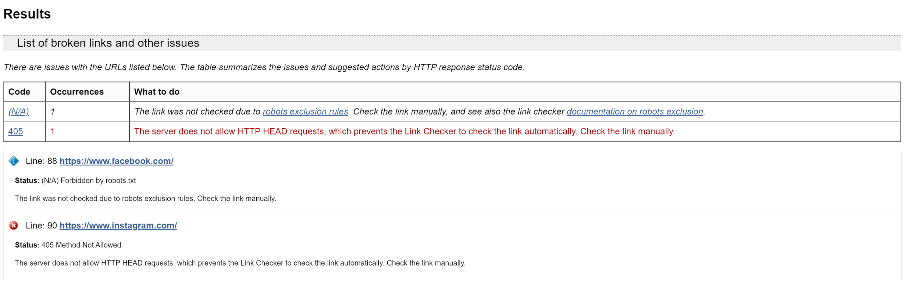
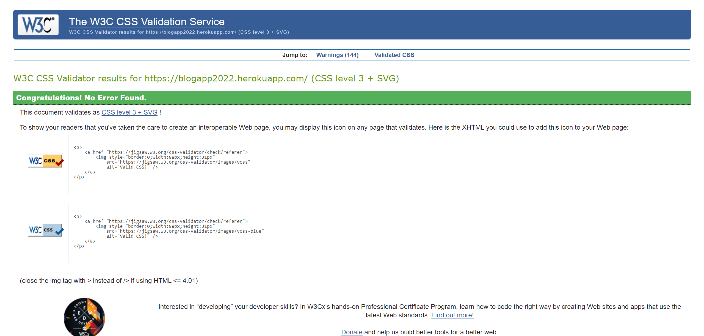
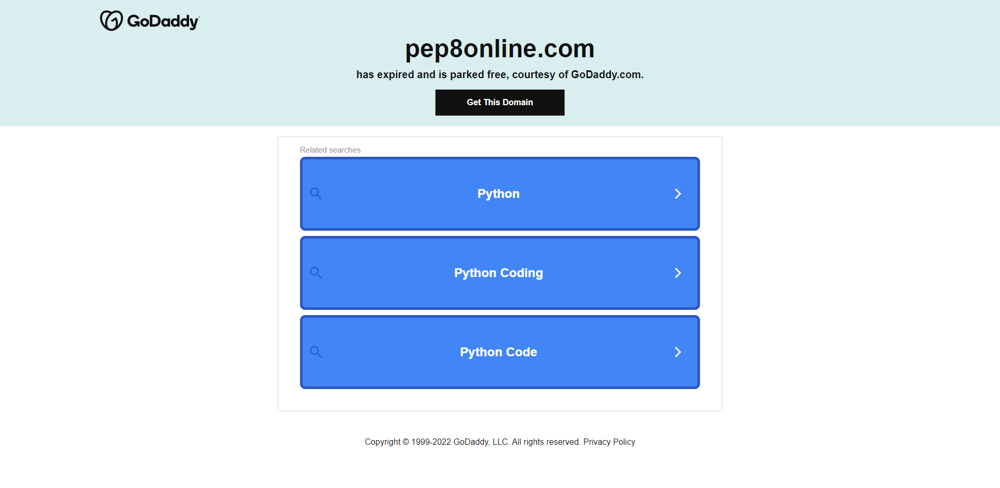

# **TESTING**
***
## **[Return to README.md](README.md)**
***
## **Content Table**
- [Bugs and Fixes During Development Process](#bugs-and-fixes-during-development-process)
- [Lighthouse](#lighthouse)
- [Validators](#validators)
    - [HTML](#html)
    - [CSS](#css)
    - [JS](#js)
    - [Python](#python)

## **Bugs and Fixes During Development Process**
- Issue = Deploying to Heroku
    - Cause = Backports zone in requirements.txt file was incorrect
        - Fix = Change `backports.zoneinfo==0.2.1` to `backports.zoneinfo;python_version<"3.9"`

- Issue = Deployment to Heroku #2 
    - Cause = Typo 
        - Fix = Correctly Spell `STATIC`

- Issue = Admin Superuser Error
    - Cause = Typo 
        - Fix = Correctly Spell `Cloudinary`

- Issue = Admin Log In Error
    - Cause = CSRF Verification Failed
        - Fix = In [settings.py](/djangoblog/settings.py), add `CSRF_TRUSTED_ORIGINS = ['https://8000-dsp1994-blogapp-dnywkgr35iz.ws-eu67.gitpod.io',]` (this has since been removed, but error did not return)

- Issue = Running View Error
    - Cause = Typo 
        - Fix = Correctly Spell `divisibleby` in the 'if statement on the [blog page](/blog/templates/blog.html)

- Issue = Static File Error
    - Cause = Link was incorrectly linked
        - Fix = Amended the `href=` within the [base template](/templates/base.html)

- Issue = Filter Error in Views - ReverseManyToOneDescriptor
    - Cause = No filter for 'object'
        - Fix = Amended line 20 in [views.py](/blog/views.py) from `blog` to `post`

- Issue = Log In/Out Error
    - Cause = No `homepage` targetted
        - Fix = Within the [settings.py](/djangoblog/settings.py), lines 63/64, changed `/` to `frontpage`

- Issue = Commenting Not Working
    - Cause = Unexpected Keyword Argument (Typo)
        - Fix = In [views.py](/blog/views.py), line 47-54, correctly spelt `comment`

- Issue = HTML Tags showing on all comments/content added through the admin site.
    - Cause = Summernote
        - Fix = Removed Summernote (as per mentors instruction)

- Issue = About page not loading on site
    - Cause = `about` not defined
        - Fix = Removed `.html` from path in [urls](/blog/urls.py) and inserted `/`

- Issue = About page not loading in admin
    - Cause = Migrations
        - Fix = Migrated the files

- Issue = Contact page wouldn't load `(this page has since been removed, but thought I'd still document the error)`
    - Cause = TypeError
        - Fix = At the end of the `.as_view` in [urls.py](/blog/urls.py) I had forgotten thr `()` which is a common mistake.

- Issue = `viewsBlogLike` not defined
    - Cause = Typo
        - Fix = Inserted `.` into correct place

- Issue = Blog page after being liked not loading
    - Cause = SyntaxError
        - Fix = within [blog.html](/blog/templates/blog_details.html) at line 27, correctly amended the `form action` by putting a `'` where needed.

- Issue = Testing Erros `(this is a section I struggled with, immensely, automated tests, so it has been removed from the final deployment, but I wanted to show that I did indeed try to do this)`
    - Cause = Unable to create correct Test.
        - Fix = Removed from the final deployment.

        
        

- Issue = Messages not showing on webpage
    - Cause = Typo
        - Fix = Within [base.html](/templates/base.html) on line 70, instead of `message` added an `s` to make it `messages`.

- Finally, there were a number of other syntax errors, where there were multiple lines of code with typo's inside them, but I've selected a small number to indicate that I am able to read the error pages correctly, and single out the section of code that needs to be amended.

***
## **Lighthouse**

As I already mentioned in my [Personal Thoughts](README.md) within my README.md section, I am aware that there is a lot that can be done to improve this website. Given time to do so, I believe I'd be able to make the correct adjustments to ensure that all four sections, Performance, Accessibility, Best Practices and SEO were all in the green.

Unfortunately time is something I am lacking. Though if I was given the opportunity, I would look into reducing the file sizes of the background images, as this was one of the issues that was brought up within the 'Performance' section. 
***
## **Validators**

### **HTML**

-- -- -- -- -- -- -- --

A number of simple errors were brought up when the site was passed through the [HTML](https://validator.w3.org/) validator. These were easily fixed. I decided to leave in the code that doesn't allow mobile users to zoom in, as I wasn't aware issues that this may cause the website, and I wouldn't want the user suffering through a bad website!

#### **Link Checker**

Apart from 2 errors, due to Facebook and Instagram, there were no issues with any links throughout the website.

### **CSS**

A large number of errors were thrown up in the [CSS](https://jigsaw.w3.org/css-validator/) validator due to the Bootstrap classes, however from my custom CSS, no errors were found. 

### **JS**
I was unable to find a reliable, none virus riddled website that was able to check my JS through the URL link.

### **Python**

Unforunately PEP8 online, seemed to be down at the time of doing my checks, and I was not able to use it. This is unfortunate as I checked multiple times before submitting my Project.

***

[Return to README.md](README.md)