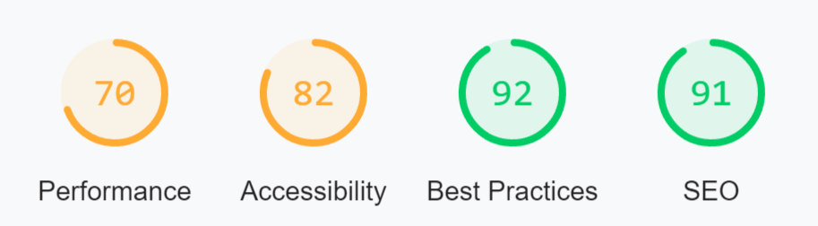

# TESTING
***
## [Return to README.md](README.md)
***
## Content Table
- [Bugs and Fixes During Development Process](#bugs-and-fixes-during-development-process)
- [Lighthouse]
- [Validators]
    - [HTML]
    - [CSS]
    - [JS]
    - [Python]

## Bugs and Fixes During Development Process

***
## Lighthouse

As I already mentioned in my [Personal Thoughts](#personal-thoughts)
***
## Validators

### HTML

### CSS

### JS

### Python

***